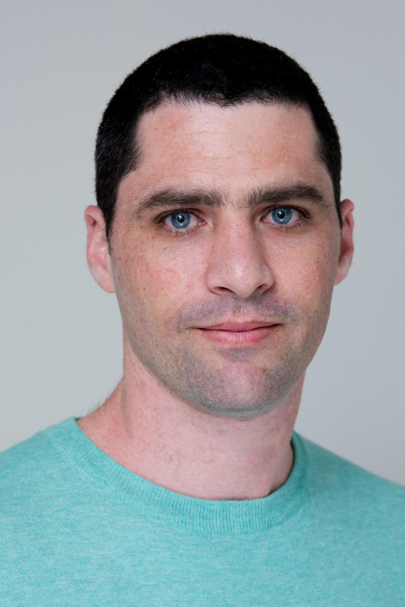

 
 

I am an academic researcher of Public Administration and Public Policy. 

My main research interest is in the interrelations between modern government bureaucratic organizations and their external audiences, and their implications for democracy.

I am currently working as a postdoctoral researcher of Public Administration at the Institute of Public Administration at Leiden University. I am conducting my research within the ERC-funded EURICA project (Reputation matters in the regulatory state: [euricaerc.eu](http://euricaerc.eu/)), led by Prof. Madalina Busuioc. 

I received my Ph.D. in Public Administration from the Hebrew University of Jerusalem in 2019. In my doctoral research, I explored how symbolic aspects in government communications with citizens influence, and manipulate, the attitudes of citizens about government organizations. In additional research projects, I studied government organizations' responses to public pressures, and specifically to large-scale social protest.

I am a methodological pluralist. I specialize in behavioral experiments, yet in my previous research, I employed a variety of additional empirical approaches, including cross-sectional time-series analyses, quantitative case studies, and quantitative and qualitative analyses of interviews. I enjoy working with data in R.

---

[`r icon::fa("envelope")` s.alon.barkat@fgga.leidenuniv.nl](mailto:s.alon.barkat@fgga.leidenuniv.nl)

[`r icon::fa("bars")` Research Gate](https://www.researchgate.net/profile/Saar_Alon-Barkat)  

[`r icon::fa("github")` saaralonbarkat](https://github.com/saaralonbarkat)

[`r icon::fa("twitter")` saarbarkat](https://twitter.com/saarbarkat)

[`r icon::fa("google")` Scholar](https://scholar.google.co.il/citations?user=KF2FL04AAAAJ&hl=en&oi=ao)

[`r icon::fa("file-powerpoint")` Publons profile](https://publons.com/researcher/1367408/saar-alon-barkat/)

<a itemprop="sameAs" content="https://orcid.org/0000-0002-3342-0568" href="https://orcid.org/0000-0002-3342-0568" target="orcid.widget" rel="noopener noreferrer" style="vertical-align:top;">orcid.org/0000-0002-3342-0568</a>

 
[`r icon::fa("download")` Download my CV](https://github.com/saaralonbarkat/site/raw/master/files/Saar%20Alon-Barkat%20CV%2004.06.19.pdf) 

---

This website was built via Rmarkdown, thanks to [this excellent tutorial](http://nickstrayer.me/RMarkdown_Sites_tutorial/). It's ridiculously easy, feel free to use [my code](https://github.com/saaralonbarkat/personal-site).   

